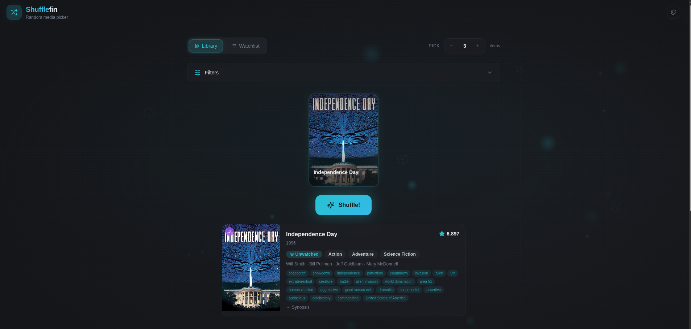
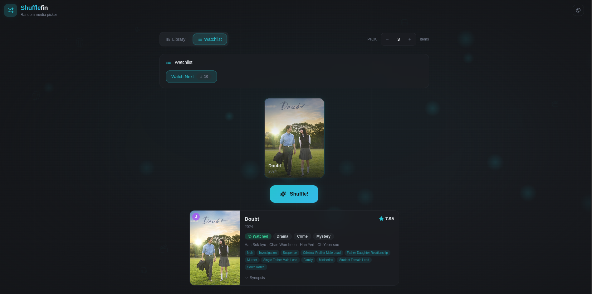
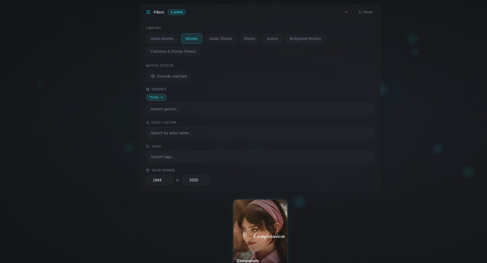
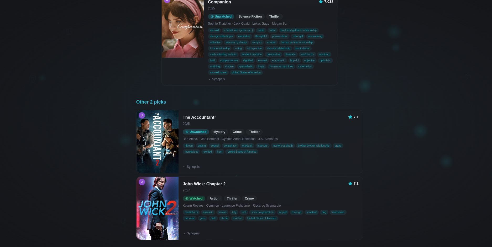

# Shufflefin

A random media picker for Jellyfin and Plex. Shufflefin helps you decide what to watch by randomly selecting movies and TV shows from your media libraries, with optional filters for genre, cast, tags, year range, and watched status.

## Features

* Shuffle random movies and TV shows from Jellyfin or Plex libraries
* Filter by genre, cast, tags, year range, and watched status
* Support for multiple picks in a single shuffle (up to 20)
* StreamyStats watchlist integration for shuffling from curated watchlists
* Server-side cast search with autocomplete
* Image proxy for media posters
* Responsive dark themed UI with customizable accent colors

## Screenshots

<table>
  <tr>
    <td></td>
    <td></td>
  </tr>
  <tr>
    <td></td>
    <td></td>
  </tr>
</table>

## Prerequisites

* Python 3.10 or higher
* Node.js 18 or higher
* A running Jellyfin or Plex media server

## Installation

Clone the repository:

```
git clone https://github.com/beeetfarmer/Shufflefin.git
cd Shufflefin
```

Install Python dependencies:

```
pip install -r backend/requirements.txt
```

Install frontend dependencies:

```
cd frontend
npm install
cd ..
```

## Configuration

Copy the example environment file and fill in your values:

```
cp .env.example .env
```

Open `.env` and configure your media server connection:

```
# Jellyfin (required for Jellyfin users)
JELLYFIN_URL=http://localhost:8096
JELLYFIN_API_KEY=your-jellyfin-api-key
JELLYFIN_USERNAME=your-jellyfin-username

# Plex (required for Plex users)
PLEX_URL=http://localhost:32400
PLEX_TOKEN=your-plex-token

# StreamyStats (optional, enables watchlist shuffle)
STREAMYSTATS_URL=http://localhost:3000
STREAMYSTATS_TOKEN=your-jellyfin-user-access-token
```

You need to configure at least one media server (Jellyfin or Plex). StreamyStats is optional and adds the ability to shuffle from your watchlists.

### Getting your API keys

**Jellyfin**: Go to Dashboard > API Keys > Create a new API key. The username should match the Jellyfin user whose libraries you want to shuffle.

**Plex**: You can find your Plex token by following the instructions at https://support.plex.tv/articles/204059436-finding-an-authentication-token-x-plex-token/

**StreamyStats**: The token is your Jellyfin user access token, which can be found in your StreamyStats user settings.

## Running

Start both the backend and frontend with a single command:

```
python run.py
```

This starts:
* Backend API at http://localhost:8005
* Frontend at http://localhost:8081

Open http://localhost:8081 in your browser to start shuffling.

Alternatively, you can start them separately:

```
# Backend
python -m uvicorn backend.main:app --reload --port 8005

# Frontend (in a separate terminal)
cd frontend
npm run dev
```

## How It Works

1. Select your media server (Jellyfin or Plex) from the header
2. Choose a library from the dropdown
3. Optionally apply filters (genre, cast, tags, year range, exclude watched)
4. Set how many picks you want
5. Hit Shuffle and watch the slot machine pick your next watch

If you have StreamyStats configured, a Watchlist mode toggle will appear, letting you shuffle from your saved watchlists instead of filtering by library.

## Tech Stack

* **Backend**: Python, FastAPI, Pydantic
* **Frontend**: React, TypeScript, Vite, Tailwind CSS, shadcn/ui, TanStack React Query, Framer Motion

## License

This project is open source. Feel free to use, modify, and distribute it.

## Thanks

* [Jellyfin](https://jellyfin.org/) for the open source media server
* [Plex](https://www.plex.tv/) for the media platform
* [StreamyStats](https://github.com/fredrikburmester/streamystats) for the statistics and watchlist platform
